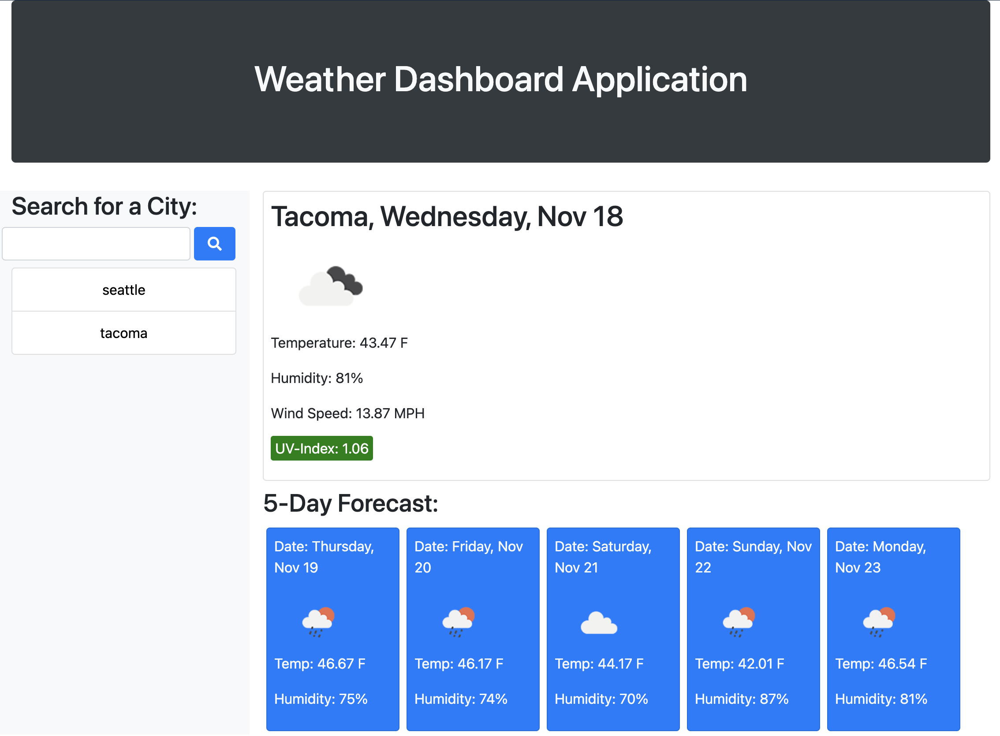

# Weather-Dashboard-Application

UW Code Bootcamp HW 6

## Table of Contents

- [Developer Comment](#developer-comment)
- [Application Summary](#application-summary)
- [User Story](#user-story)
- [Acceptance Criteria](#acceptance-criteria)
- [Mockup](#mockup)
- [Website Features and Highlights](#website-features-and-highlights)
- [Live Project Site](#live-project-site)
- [Installation and Git Repository](#installation-and-git-repository)
- [Credits](#credits)

## Developer Comment

Hello everyone, and welcome back to my Repo! My name is Abdulhakeem Dahir and I am an aspiring Software Developer. This week I have been tasked to make a Weather Dashboard Application. We had to use multiple API requests and drill down to get the necessary information that we wanted. It was pretty difficult, and though I got it done, I'm hoping to increase my understanding of WHY it works more. Any feedback is welcome! Thank you!

## Application Summary

A user who travels would like an application that would enable them to see the weather before they travel:

### User Story

```
AS A traveler
I WANT to see the weather outlook for multiple cities
SO THAT I can plan a trip accordingly
```

### Acceptance Criteria

```
GIVEN a weather dashboard with form inputs
WHEN I search for a city
THEN I am presented with current and future conditions for that city and that city is added to the search history
WHEN I view current weather conditions for that city
THEN I am presented with the city name, the date, an icon representation of weather conditions, the temperature, the humidity, the wind speed, and the UV index
WHEN I view the UV index
THEN I am presented with a color that indicates whether the conditions are favorable, moderate, or severe
WHEN I view future weather conditions for that city
THEN I am presented with a 5-day forecast that displays the date, an icon representation of weather conditions, the temperature, and the humidity
WHEN I click on a city in the search history
THEN I am again presented with current and future conditions for that city
WHEN I open the weather dashboard
THEN I am presented with the last searched city forecast
```

## Mockup

The following image demonstrates the application functionality:


## Website Features and Highlights

The follwing are all of the feautres and highlights of my portfolio:

### HTML & CSS

```
- Created a responsive HTML shell for my code to run
- Created the necessary structure for the Weather Dashboard
- Used Bootstrap to create the layout and design of the Application
- Used Flex Box and Column widths to make responsive on all devices
```

### JAVASCRIPT

```
- Set up date and time variables with Moment JS
- Used my setup Data Attrubutes as Conditionals
- Called Current Weather API for latest weather
- Took the Long and Lat from Current Weather API and passed it into ONE API
- Able to get both UV Index and 5 Day Forecast from API request
- Dynamically generated all UI elements when user searches for city
- Color coded UV Index for Favorable, Moderate and Severe
- Stored all searched values to Local Storage
- User can see their first search upon reload

```

## Live Project Site

https://abdulhakeemdahir.github.io/Weather-Dashboard-Application/



## Installation and Git Repository

Respository: https://github.com/abdulhakeemdahir/Weather-Dashboard-Application

Please follow the installation process below:

```
1. Fork the repository from the link above
2. Clone the repo to your computer via git
3. Open the project files with the text editor of your choice.
```
